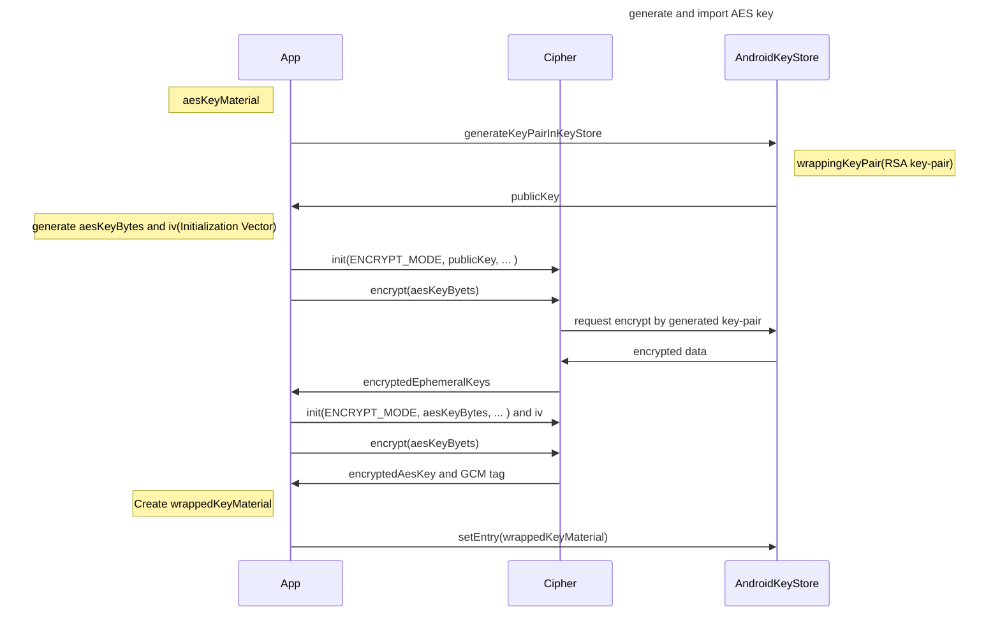

# android-secure-import-samples
Secure import samples for Android

https://github.com/keiji/android-secure-import-samples/blob/main/app/src/main/java/dev/keiji/keypair_import/sample/MainViewModel.kt

## Reference
* Import encrypted keys into secure hardware
  * https://developer.android.com/training/articles/keystore#ImportingEncryptedKeys
* Certificate extension data schema 
  * https://developer.android.com/training/articles/security-key-attestation#certificate_schema
* ImportWrappedKeyTest.java
  * https://android.googlesource.com/platform/cts/+/master/tests/tests/keystore/src/android/keystore/cts/ImportWrappedKeyTest.java
